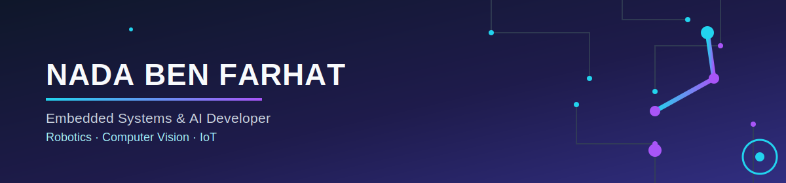

  

<h1 align="center">Hi 👋, I'm Nada Ben Farhat</h1>
<h3 align="center">Embedded Systems & AI Developer | Robotics, Computer Vision & IoT 🤖</h3>

  

  
  

---

### 👋 About Me

🎓 Bachelor's Degree in **Electronics, Electrical Engineering and Automation (EEA)**, specialization in **Embedded Systems**, from **ISSAT Sousse, Tunisia (2026)** — **Highest Honors**
🤖 Passionate about **robotics**, **embedded AI**, and **computer vision**
💼 Open to **full-time opportunities** in Embedded Systems, AI & Robotics — currently pursuing a Research Master's at ENISo alongside
🌍 Open to relocating internationally — internships, work-study, or full-time roles

---

### ⚙️ Skills

#### 💻 Programming & Tools

#### 🧠 AI & Computer Vision

#### ⚡ Embedded Systems & IoT

---

### 📚 Education

**ISSAT Sousse** — Bachelor's Degree in Electronics, Electrical Engineering and Automation (EEA), Embedded Systems track *(2023 – 2026)* — Highest Honors
**ENISo** — Research Master's, Advanced Techniques in Electrical Engineering *(2026 – present)*

---

### 💼 Experience & Key Projects

**AI/ML Intern — Deep Alpha Strategies Limited (DAS)**, London (remote) *(Feb–May 2026)*
Final year project: AI-based mobile app for fitness posture analysis

**Consultant/Developer — AAI** *(current)*
Energy & data infrastructure projects

**🏋️ AI Fitness Coaching Robot** *(Final Year Project)*
Gym-coaching robot built on **NVIDIA Jetson**, real-time posture analysis, web dashboard, voice feedback and on-robot local feedback.

**✋ AI Hand-Gesture Interface Controller**
Real-time hands-free app control via webcam using **Python, OpenCV & MediaPipe** (selfie segmentation, hand landmark tracking) — demoed controlling YouTube and browser navigation by gesture.

**🔥 Autonomous Fire & Gas Detection Vehicle**
Autonomous vehicle that detects fire/gas, alerts the client automatically, and extinguishes fire using water.

**🔐 Smart Lock — Facial Recognition**
Smart lock system combining facial recognition with a card-based unlocking mechanism.

---

### 🎯 What I'm Looking For

- 💼 **Full-time roles** in Embedded Systems, AI, or Robotics (Tunisia or abroad)
- 🌍 Open to **relocating internationally** for the right opportunity
- 🤝 **Collaborations** on open-source embedded / edge AI projects
- 📩 Feel free to reach out!

---

### 📊 GitHub Stats

  

  

  

---

💬 Feel free to reach out for collaborations in robotics, AI, or embedded systems!

